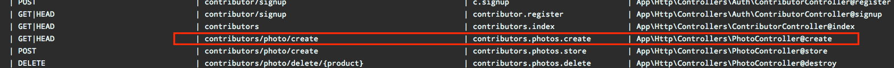
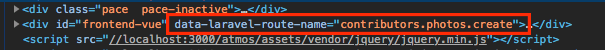

# Laravel Route Scripts

> This package helps to execute Javascript with all the power of laravel mix webpack in your Laravel Named Routes.

Sometimes you don't have a running SPA in your Laravel app but you want to run modern javascript with laravel mix workflow on specific pages to ad some vuejs interactions. If that's the case this package can help you.

## Installation

1. Install as dependency: `npm instal laravel-route-scripts --save-dev` or `yarn add laravel-route-scripts --dev`

## Usage

1. In your main view layout blade file you must set to any element the attribute: `data-laravel-route-name="{{ Route::currentRouteName() }}"`. You can get all your routes name by running `php artisan route:list`
2. Then just need to create a javascrtipt file on any location inside `resources/js` and import it in your mail js file.
3. Import in your new file the library. Example: `import LR from 'laravel-route-scripts'`
4. In the new file create a new instance `new LR('laravel.name.route').onInit(() => { console.log('js code here') })`, if you need to run the same code on several routes you can also use an array of route names in the constructor function.
4. You can chain this methods: `onInit` or `docReady` with a callback with your code.


### How it works
> `php artisan route list` - Run this command to locate your target route name in this example we use: contributors.photos.create
 


> `data-laravel-route-name="{{ Route::currentRouteName() }}"` will create this attribute.
 


> **New imported file example.**
```js
import LR from 'laravel-route-scripts';

// pass the route name or array of route names ['contributors.photos.create', 'contributors.photos.show']
new LR('contributors.photos.create')
  .onInit((lr) => {

    console.log('This run immediately javascript executes')

    // with the lr reference you can access to the current instance
    lr.initVue({
      el: '#frontend-vue',
      data () {
        return {
          title: 'title'
        }
      },
    })
    
    // helper function to check if you are in specific route, handy when you are running in multiple routes
    console.log(lr.isRoute('contributors.photos.create'))

  }).docReady((lr) => {
    console.log('This runs when the DOM is ready')
    
    console.log(lr.$vi); // access the created vuejs instance
  })
```

### Available API:

<table>
	<tr>
		<th>Method Name</th>
		<th>Description</th>
	</tr>
    <tr>
        <td>contructor</td>
        <td>Param: <strong>string</strong> | <strong>array</strong>, single string with a laravel route named route or a array of them.</td>
    </tr>
	<tr>
		<td>onInit</td>
		<td>Param: <strong>function</strong>, this method receives as a callback that run immediately javascript executes.</td>
	</tr>
	<tr>
		<td>docReady</td>
		<td>Param: <strong>function</strong>, this method receives a function as a callback that run after DOM content is ready.</td>
	</tr>
	<tr>
		<td>initVue</td>
		<td>Param: <strong>object</strong>, troughthout the instance reference inside of onInit or docReady you can initialize VueJS passing the VueJS instanciation object. This also create a internal vue instance referece named <strong>$vi</strong>.</td>
	</tr>
	<tr>
		<td>isRoute</td>
		<td>Param: <strong>object</strong>, troughthout the instance reference inside of onInit or docReady you can access this helper method to check if the current route if a specific one.</td>
	</tr>
</table>

#### **NOTES**: 

1. `onInit` and `docReady` have access to receive an parameter that reference the instance itself.
